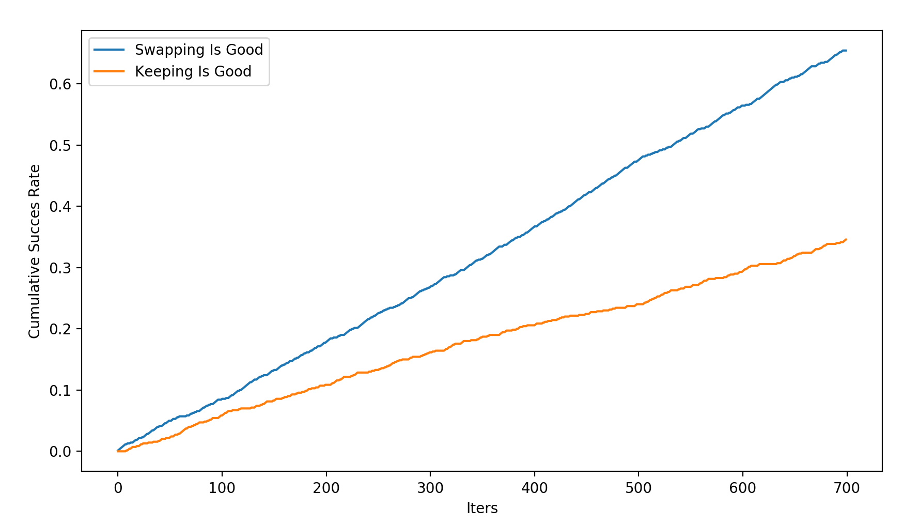

# Monty Hall Problem 

The Monty Hall problem has always been something that has challenged me intuitively so I decided to tackle it from a pythonic point of view. In this repo I made a simple `Monty_Hall` class in python that attempts to express the unique statistic nature of this problem. Below is an explanation:

````
FOR N Doors It is ALLWAYS Better to Switch

##########   ##########   ########## 
#        #   #        #   #        #   
#        #   #        #   #        #
#  GOAT  #   #  GOLD  #   #  GOAT  # 
#        #   #        #   #        #
#        #   #        #   #        #
##########   ##########   ##########
````

#### Explanation:

Suppose you are on a game show and there are 3 doors. Behind two of the doors are goats and the remaining 3rd door has gold. There are two rounds to this game. In the first round, you must pick one of the 3 doors as your choice. Here your probability of picking a gold behind a door is 1/3 and a goat is 2/3. When you pick a door the game show host does not open it. Following your choice, the host then removes one of the doors that has a goat behind it. (It is assumed here that the game show host always removes a goat door because he/she knowns whats behind all doors). 

````
2 Doors Remain

##########   ##########   
#        #   #        #     
#        #   #        #   
#  GOAT  #   #  GOLD  #   
#        #   #        #   
#        #   #        #  
##########   ##########   
````
Now you enter the second round where two doors that remain: the door you initially selected and the other mystery door. Should you keep your choice or swap your choice to the other door? If so why?

#### Solution:

Because there are only two doors remaining in the second round, it is tempting to think you have a 50/50 chance at selecting the right door in the second round, but it isn't true- you **cannot** discount the first round. As we agreed before, in the first round, each door has a 1/3 probability of having GOLD. Looking at it another way, for a door you select in the first round, no matter what, your chance (of success) will remain 1/3 in the second round. Even if 100 doors were added after, because of your initial circumstances, your probability is 1/3. Likewise, in the first round, for every door you select, your success rate is 1/3 and remainder doors have a combined succes probability of 2/3 (1/3 + 1/3). Unfortunately, you cannot choose two doors at once! Well, the host makes that easy by removing one of the doors with a goat in round 2. As such, switching your decision is ~2/3 or approximately 2x better than keeping your decision (1/3)!


Below is an brute force illustration of several hundred games and the success rates over time. 



---

#### Some Code (Python 3.6+): 
`git clone https://github.com/eddymina/monty_hall`

```python
from monty import Monty_Hall 

## Set niters>700 to to smooth out noise 
## Might want to set verbose to false too! 

mh=Monty_Hall(niters=2,verbose=True) #set the number of iterations and print results (verbose is False)
mh.compute() #
mh.plot_res() #compute() is needed prior to plot results 
```
```
--------------------
Prize location:: 2 | User choice:: 1 | States:: [0 1 0]
Removing door:: 3
Swap door::2 | Keep door::1
Swapping was a good choice

Iter 1---------------------
Prize location:: 2 | User choice:: 2 | States:: [0 1 0]
Removing door:: 3
Swap door::1 | Keep door::2
Keeping was good choice
##Computations Done##
```
---

#### Methodology 
```
1. Randomly choose a prize location and define state. (EX: [0 1 0], prize is at location 2 (index 1))
2. Remove a door that has a goat and is not the door your selected (obviously)
3. Allow user to swap and keep choice 
4. Compute Cumulative Success Rate:
	For an iteration:	
		success_keeping == 1 else it is 0 
		success_swapping == 1 else it is 0 

5. For all iterations sum the successes
6. Plot Results 
```


